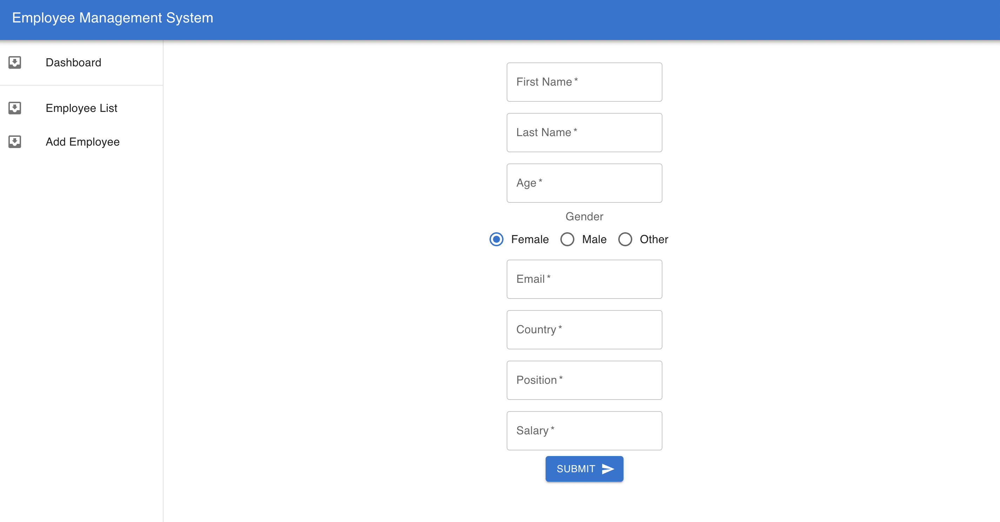
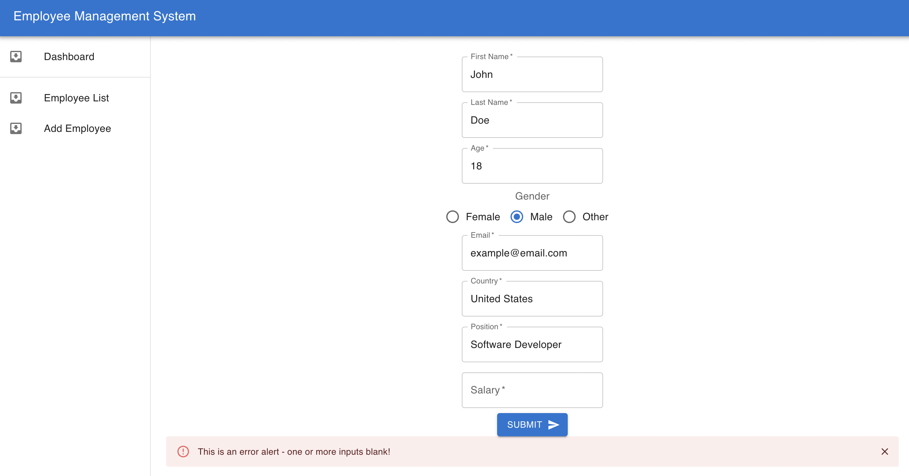
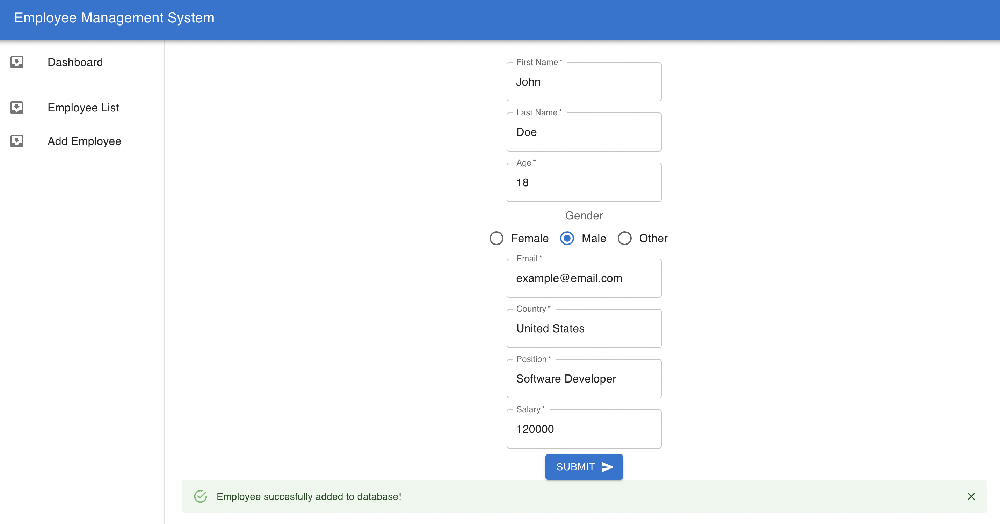
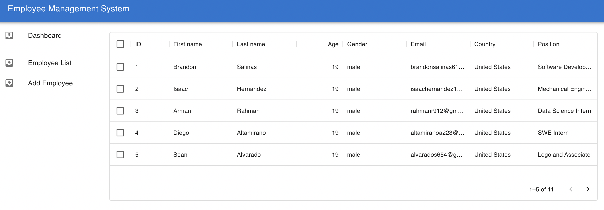

# employee-management-system

#### This application is not currently published

### About the App

This is an employee management system where an employeer can add an application for an employee or remove an employee from the employee database. The employee application has coventional safety nets to ensure a full application is submitted.

### Screenshots

`Note: the information in the table is based on real people but the application information is completely false`

### Technologies
I built this application using React, Node.js, express, MySQL, Javascript, HTML, and CSS

### Setup
- download or clone the repository

client setup:
- cd into client folder
- run `npm install`
- run `npm start` to run on local machine

server setup:
- cd into server folder in seperate terminal
- run `npm install`
- run `node index.js`

### Status
I plan to update this application by updating the dashboard and allow the employeer to have more functionality and control over employees. For example, being able to update salary or other variables in an employees account.

### License

MIT license @ bsalinassanchez

